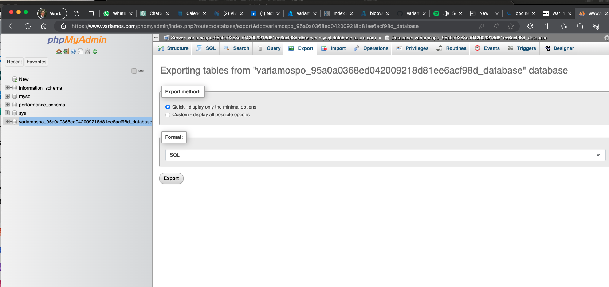

# VariamosPortal
Variamos Landing Page

## Control version WordPress sites with Git

1. Create a Git Repository in GitHub with WordPress .gitignore

2. Download with FileZilla the contents of the Site into wwwroot folder from GitHub root.

3. Export the DataBase from phpMyAdmin.

